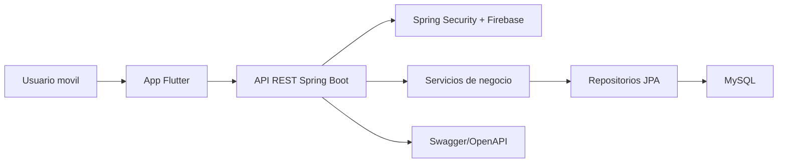

# SportAccess - Documentacion base del TFG

## Datos del proyecto

| Campo | Contenido |
|---|---|
| Titulo provisional | SportAccess: plataforma multiplataforma para reservas y gestion de instalaciones deportivas |
| Centro | CIFP Politecnico de Cartagena |
| Localidad | Cartagena, Region de Murcia |
| Ciclo | CFGS Desarrollo de Aplicaciones Multiplataforma |
| Modulo | 0492. Proyecto de Desarrollo de Aplicaciones Multiplataforma |
| Curso | 2025-2026 |
| Repositorio | https://github.com/BlueMichelle/SportAccess |

## Resumen

SportAccess es una aplicacion multiplataforma orientada a la gestion de instalaciones deportivas. El sistema permite consultar pistas, registrar usuarios, crear reservas, controlar solapes horarios, generar o validar accesos mediante QR y registrar incidencias asociadas a instalaciones o reservas.

El proyecto se compone de un backend REST desarrollado con Spring Boot y una aplicacion movil desarrollada con Flutter. La solucion se apoya en una base de datos MySQL, autenticacion vinculada a Firebase y una arquitectura por capas que separa controladores, servicios, repositorios, modelos, DTOs, configuracion y seguridad.

## Justificacion

La gestion manual de reservas deportivas suele generar problemas de disponibilidad, duplicidad de horarios, poca trazabilidad de incidencias y dificultad para validar accesos. SportAccess aborda estas necesidades mediante una solucion digital que centraliza la informacion, automatiza la reserva de pistas y facilita el seguimiento de problemas operativos.

En el contexto de Cartagena y la Region de Murcia, el proyecto encaja con un entorno educativo y deportivo en el que centros, usuarios y responsables de instalaciones necesitan herramientas sencillas para organizar turnos, validar accesos y mantener las instalaciones en buen estado.

## Objetivo general

Desarrollar una aplicacion multiplataforma que permita gestionar reservas de instalaciones deportivas, usuarios, accesos e incidencias, garantizando persistencia de datos, control de disponibilidad, seguridad basica y documentacion tecnica suficiente para su despliegue y mantenimiento.

## Objetivos especificos

- Diseñar una arquitectura cliente-servidor con backend REST y aplicacion movil.
- Implementar modelos de datos para usuarios, pistas, centros deportivos, reservas, pagos e incidencias.
- Crear endpoints para consulta de pistas, gestion de reservas, historial de usuario, incidencias y administracion.
- Evitar reservas solapadas mediante validaciones de disponibilidad en el backend.
- Integrar autenticacion de usuarios con Firebase o un flujo compatible de identificacion.
- Permitir validacion de reservas mediante token o codigo QR.
- Documentar la instalacion, configuracion, ejecucion local y despliegue del sistema.
- Relacionar el desarrollo con los resultados de aprendizaje del modulo de proyecto.

## Alcance funcional

### Aplicacion movil

- Pantalla de inicio y navegacion principal.
- Registro e inicio de sesion de usuarios.
- Consulta de instalaciones o pistas disponibles.
- Creacion de reservas.
- Consulta de historial.
- Pantalla de pago o simulacion de pago.
- Generacion y visualizacion de QR de reserva.
- Escaneo o validacion de QR.
- Registro de incidencias desde el entorno movil.

### Backend

- API REST con Spring Boot.
- Persistencia mediante Spring Data JPA.
- Base de datos MySQL.
- Entidades principales: `User`, `Court`, `SportsCenter`, `Booking`, `Reservation`, `Payment`, `Incident`.
- Controladores principales: usuarios, pistas, centros deportivos, reservas, reservas historicas, pagos e incidencias.
- Seguridad con Spring Security y filtro de token Firebase.
- Documentacion tecnica de API mediante SpringDoc/OpenAPI.
- Configuracion Docker para entorno local.

## Arquitectura tecnica

## Stack tecnologico

| Capa | Tecnologia |
|---|---|
| Movil | Flutter, Dart |
| Comunicacion HTTP | Dio |
| Backend | Java 17, Spring Boot |
| Seguridad | Spring Security, Firebase Admin SDK |
| Persistencia | Spring Data JPA, Hibernate |
| Base de datos | MySQL |
| Documentacion API | SpringDoc OpenAPI, Swagger UI |
| Contenedores | Docker, Docker Compose |
| Control de versiones | Git, GitHub |

## Metodologia de trabajo

El proyecto se organiza mediante una metodologia incremental, dividiendo el desarrollo en tareas tecnicas y funcionales:

1. Configuracion inicial del repositorio, backend y aplicacion movil.
2. Definicion del modelo de datos y entidades principales.
3. Desarrollo de endpoints REST para usuarios, pistas, reservas e incidencias.
4. Integracion de la aplicacion Flutter con el backend.
5. Validacion de reservas, control de solapes y gestion de estados.
6. Documentacion tecnica, pruebas y preparacion de la memoria final.

## Planificacion inicial

| Fase | Contenido | Evidencia |
|---|---|---|
| Analisis | Necesidades, alcance, usuarios y requisitos | Memoria, matriz RAS, backlog |
| Diseño | Arquitectura, modelo de datos, endpoints, pantallas | Diagramas, README, documentacion tecnica |
| Implementacion backend | API REST, seguridad, persistencia | Codigo en `backend/` |
| Implementacion movil | Pantallas, navegacion, servicios HTTP | Codigo en `mobile/` |
| Validacion | Pruebas funcionales, revision de errores, Swagger | Capturas, checklist, issues |
| Entrega | Memoria final, anexos, presentacion | Documentacion en `docs/` |

## Riesgos y medidas

| Riesgo | Impacto | Medida |
|---|---|---|
| Solapes de reservas | Reservas duplicadas | Validacion en backend antes de guardar |
| Diferencias entre modelos `Booking` y `Reservation` | Inconsistencia funcional | Unificar criterio de reservas en la memoria tecnica |
| Dependencia de Firebase | Dificultad en pruebas locales | Documentar modo local y variables de entorno |
| Ausencia de tests automatizados | Menor garantia de regresion | Crear pruebas minimas de servicios y controladores |
| Archivos generados por IDE o Flutter | Ruido en el repositorio | Reforzar `.gitignore` y documentar limpieza |

## Referencias normativas y curriculares

- Real Decreto 450/2010, de 16 de abril, por el que se establece el titulo de Tecnico Superior en Desarrollo de Aplicaciones Multiplataforma: https://www.boe.es/eli/es/rd/2010/04/16/450
- Real Decreto 405/2023, de 29 de mayo, por el que se actualizan los titulos de DAM y DAW: https://www.boe.es/eli/es/rd/2023/05/29/405
- Programaciones de DAM en la Region de Murcia para el modulo 0492, que lo recogen como modulo de 30 horas y 5 ECTS.

## Pendientes para completar la memoria final

- Añadir autores, tutor/a, departamento y convocatoria exacta.
- Confirmar si el centro exige plantilla oficial del CIFP Politecnico de Cartagena.
- Incluir capturas reales de la app movil y Swagger.
- Generar diagrama entidad-relacion final.
- Definir si la memoria usara `Reservation`, `Booking` o ambos conceptos.
- Añadir presupuesto, conclusiones, bibliografia y anexos.
