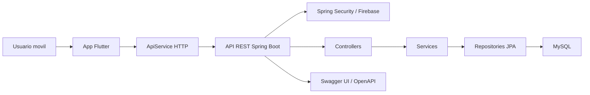

# SportAccess

## Plataforma multiplataforma para reservas y gestion de instalaciones deportivas

**Memoria del Proyecto de Desarrollo de Aplicaciones Multiplataforma**

| Dato | Contenido |
|---|---|
| Ciclo formativo | CFGS Desarrollo de Aplicaciones Multiplataforma |
| Modulo | 0492. Proyecto de Desarrollo de Aplicaciones Multiplataforma |
| Centro | CIFP Politecnico de Cartagena |
| Localidad | Cartagena, Region de Murcia |
| Curso | 2025-2026 |
| Alumno/a | Pendiente de completar |
| Tutor/a | Pendiente de completar |
| Repositorio | https://github.com/BlueMichelle/SportAccess |
| Fecha | Mayo de 2026 |

## Agradecimientos

Quiero agradecer al profesorado del ciclo de Desarrollo de Aplicaciones Multiplataforma la orientacion recibida durante el proceso de aprendizaje, especialmente en las areas de programacion, bases de datos, acceso a datos, desarrollo de interfaces y despliegue de aplicaciones. Tambien agradezco el apoyo de las personas que han colaborado en la revision del proyecto, en las pruebas funcionales y en la deteccion de mejoras.

Este proyecto ha permitido aplicar de forma integrada los conocimientos adquiridos durante el ciclo, transformando una necesidad real en una solucion tecnica completa: una aplicacion movil conectada a un backend, con persistencia de datos, validacion de reservas, control de acceso, incidencias y documentacion tecnica.

## Resumen

SportAccess es una aplicacion multiplataforma orientada a la gestion de reservas de instalaciones deportivas. El sistema permite consultar pistas disponibles, registrar usuarios, crear reservas, controlar solapes horarios, generar codigos QR de acceso, consultar historial de reservas y registrar incidencias asociadas a instalaciones o reservas.

La solucion esta formada por una aplicacion movil desarrollada con Flutter y Dart, un backend REST desarrollado con Spring Boot, una base de datos MySQL y una capa de seguridad basada en Spring Security con integracion preparada para Firebase. El proyecto tambien incluye documentacion tecnica, scripts SQL, configuracion Docker, Swagger/OpenAPI y una organizacion por capas que facilita el mantenimiento.

## Abstract

SportAccess is a multiplatform application designed to manage bookings for sports facilities. It allows users to browse available courts, register, create bookings, prevent time overlaps, generate QR access codes, review booking history and report incidents related to facilities.

The solution is composed of a Flutter mobile application, a Spring Boot REST backend, a MySQL database and a security layer prepared for Firebase authentication. The project includes technical documentation, SQL scripts, Docker configuration and an organized layered architecture.

## Indice

1. Introduccion
2. Justificacion del proyecto
3. Objetivos
4. Analisis de necesidades
5. Alcance
6. Tecnologias utilizadas
7. Arquitectura del sistema
8. Organizacion del proyecto
9. Diseno de la base de datos
10. Backend
11. Aplicacion movil
12. Seguridad
13. Pruebas y depuracion
14. Despliegue y configuracion
15. Planificacion
16. Relacion con los resultados de aprendizaje de DAM
17. Manual de instalacion y uso
18. Conclusiones
19. Mejoras futuras
20. Bibliografia y referencias
21. Anexos

## 1. Introduccion

SportAccess nace como un proyecto de fin de ciclo para el CFGS de Desarrollo de Aplicaciones Multiplataforma. Su finalidad es resolver una necesidad habitual en instalaciones deportivas: gestionar reservas de forma clara, evitar duplicidades, centralizar los datos de usuarios y facilitar el control de acceso a traves de codigos QR.

El proyecto adopta una arquitectura cliente-servidor. La aplicacion movil es el punto de entrada para el usuario final y consume una API REST. El backend gestiona la logica de negocio, la persistencia, la validacion de reservas y la exposicion de servicios. La base de datos almacena usuarios, centros deportivos, pistas, reservas, pagos e incidencias.

La memoria documenta el proceso completo: analisis, diseno, implementacion, pruebas, despliegue, relacion curricular con los resultados de aprendizaje de DAM y anexos de apoyo para la defensa.

## 2. Justificacion del proyecto

La gestion manual de pistas deportivas puede provocar errores frecuentes: reservas duplicadas, horarios no actualizados, falta de informacion sobre disponibilidad, dificultad para identificar al usuario que ha reservado y poca trazabilidad cuando aparece una incidencia en una instalacion.

SportAccess plantea una solucion digital que mejora estos procesos mediante:

- Consulta centralizada de pistas e instalaciones.
- Reserva de franjas horarias desde una aplicacion movil.
- Validacion de solapes en backend antes de guardar la reserva.
- Historial de reservas asociado al usuario.
- Codigo QR para identificar una reserva concreta.
- Registro de incidencias con estado y trazabilidad.
- API documentada y preparada para pruebas mediante Swagger.

En el contexto de Cartagena y la Region de Murcia, la aplicacion puede adaptarse a polideportivos municipales, centros educativos, clubes deportivos o instalaciones privadas que necesiten organizar recursos compartidos.

## 3. Objetivos

### 3.1 Objetivo general

Desarrollar una aplicacion multiplataforma que permita gestionar reservas de instalaciones deportivas, usuarios, accesos e incidencias mediante una app movil, una API REST y una base de datos relacional.

### 3.2 Objetivos especificos

- Disenar una arquitectura cliente-servidor mantenible.
- Implementar una app movil con pantallas de login, registro, inicio, reservas, pago, historial, QR y escaner.
- Desarrollar un backend REST con controladores, servicios, repositorios, entidades y configuracion de seguridad.
- Crear un modelo de datos relacional para usuarios, centros deportivos, pistas, reservas, pagos e incidencias.
- Validar la disponibilidad de una pista para evitar reservas solapadas.
- Registrar incidencias y permitir el cambio de estado.
- Preparar documentacion tecnica de instalacion, ejecucion, endpoints y estructura.
- Relacionar el trabajo realizado con los resultados de aprendizaje del ciclo DAM.

## 4. Analisis de necesidades

### 4.1 Usuarios del sistema

| Actor | Necesidad principal |
|---|---|
| Usuario deportista | Consultar pistas, reservar, pagar o simular pago, obtener QR y consultar historial |
| Responsable de instalacion | Revisar reservas, validar accesos y conocer incidencias |
| Administrador tecnico | Mantener backend, base de datos, configuracion y despliegue |
| Personal de mantenimiento | Recibir o consultar incidencias asociadas a pistas |

### 4.2 Requisitos funcionales

- RF01. Registrar usuarios en el sistema.
- RF02. Iniciar sesion con un usuario registrado.
- RF03. Consultar listado de pistas deportivas.
- RF04. Consultar detalle de una pista.
- RF05. Seleccionar fecha y franja horaria.
- RF06. Crear una reserva asociada a usuario y pista.
- RF07. Evitar la creacion de reservas solapadas.
- RF08. Cancelar una reserva mediante cambio de estado.
- RF09. Consultar historial de reservas.
- RF10. Generar o mostrar codigo QR de una reserva.
- RF11. Escanear QR y validar una reserva existente.
- RF12. Registrar incidencias sobre una pista o reserva.
- RF13. Consultar incidencias de un usuario.
- RF14. Cambiar el estado de una incidencia.

### 4.3 Requisitos no funcionales

- RNF01. La aplicacion debe separar interfaz, logica de negocio y acceso a datos.
- RNF02. La API debe devolver respuestas comprensibles y codigos HTTP adecuados.
- RNF03. La base de datos debe mantener integridad referencial.
- RNF04. Las credenciales sensibles no deben subirse al repositorio.
- RNF05. El proyecto debe poder ejecutarse en local.
- RNF06. La documentacion debe permitir que otro desarrollador instale y pruebe la solucion.
- RNF07. El sistema debe estar preparado para crecer con autenticacion real, pagos reales y despliegue en produccion.

## 5. Alcance

El alcance del proyecto incluye:

- App movil funcional con flujo principal de usuario.
- Backend REST con endpoints para usuarios, pistas, centros, reservas, bookings e incidencias.
- Persistencia en MySQL mediante Spring Data JPA.
- Validacion de solapes de reservas.
- Codigo QR en app movil.
- Escaneo de QR mediante libreria movil.
- Configuracion local y Docker.
- Documentacion tecnica y memoria final.

Quedan fuera del alcance inicial:

- Pasarela de pago real en produccion.
- Panel web administrativo completo.
- Publicacion definitiva en tiendas moviles.
- Sistema avanzado de notificaciones.
- Analitica de uso.
- Despliegue productivo con dominio y certificados.

## 6. Tecnologias utilizadas

| Area | Tecnologia | Uso en el proyecto |
|---|---|---|
| Movil | Flutter | Desarrollo de la aplicacion multiplataforma |
| Lenguaje movil | Dart | Programacion de pantallas, modelos y servicios |
| HTTP | Dio / http | Comunicacion con la API REST |
| Persistencia local | shared_preferences | Guardado de datos de sesion y apoyo local |
| Calendario | table_calendar | Seleccion de fechas de reserva |
| QR | qr_flutter | Generacion visual de codigos QR |
| Escaner | mobile_scanner | Lectura de codigos QR desde camara |
| Backend | Spring Boot 3.4.4 | API REST y logica de servidor |
| Lenguaje backend | Java 21 | Implementacion del servidor |
| ORM | Spring Data JPA / Hibernate | Acceso a datos |
| Base de datos | MySQL | Persistencia relacional |
| Seguridad | Spring Security / Firebase Admin SDK | Preparacion de autenticacion y validacion de tokens |
| Documentacion API | SpringDoc OpenAPI / Swagger UI | Pruebas y documentacion de endpoints |
| Contenedores | Docker / Docker Compose | Entorno reproducible backend + base de datos |
| Control de versiones | Git / GitHub | Seguimiento de cambios |

## 7. Arquitectura del sistema

La arquitectura se organiza en capas para separar responsabilidades:



### 7.1 Flujo de una reserva

1. El usuario inicia sesion o se registra en la app.
2. La app solicita las pistas al backend.
3. El usuario selecciona pista, fecha y horario.
4. La app envia la solicitud de reserva a `/api/reservations`.
5. El backend consulta si existe un solape para esa pista y horario.
6. Si existe solape, devuelve `409 CONFLICT`.
7. Si no existe solape, crea la reserva, genera o guarda `qrToken` y confirma la operacion.
8. La app muestra el QR de la reserva.

## 8. Organizacion del proyecto

La organizacion del repositorio separa backend, aplicacion movil, documentacion, diagramas y scripts SQL:

```text
ProyectoFinal_PoliRect/
|-- backend/                 # API REST Spring Boot
|-- mobile/                  # Aplicacion movil Flutter
|-- docs/                    # Memoria, anexos y documentacion tecnica
|-- sql/                     # Esquema, datos de prueba y consultas utiles
|-- Diagramas/               # Bocetos y diagramas de arquitectura
|-- .github/                 # Configuracion relacionada con GitHub
|-- README.md                # Documentacion principal del repositorio
|-- .gitignore               # Exclusiones de generados, IDE y secretos
```

La estructura detallada tipo arbol comentado se incluye en el documento `docs/ESTRUCTURA_PROYECTO_SPORTACCESS.md`.

## 9. Diseno de la base de datos

### 9.1 Entidades principales

| Entidad | Finalidad |
|---|---|
| User | Datos de usuario, email, UID Firebase, telefono, rol y estado |
| SportsCenter | Centro deportivo al que pertenecen las pistas |
| Court | Pista deportiva, tipo, precio, descripcion, imagen y estado |
| Reservation | Reserva principal usada por la app movil, con fecha, estado y QR |
| Booking | Modelo adicional de reserva historica/API con estado y QR |
| Payment | Informacion preparada para pagos |
| Incident | Incidencias asociadas a usuario, pista y opcionalmente reserva |

### 9.2 Relaciones

- Un centro deportivo puede tener varias pistas.
- Una pista puede tener varias reservas.
- Un usuario puede tener varias reservas.
- Una incidencia pertenece a un usuario y a una pista.
- Una incidencia puede estar vinculada a una reserva concreta.
- Un pago puede estar asociado a una reserva/booking.

### 9.3 Control de solapes

La validacion de solapes se realiza en `ReservationRepository` mediante una consulta que comprueba si existe una reserva activa en la misma pista cuyo intervalo se cruza con el nuevo intervalo:

```text
reserva.fechaInicio < nuevaFechaFin
y
reserva.fechaFin > nuevaFechaInicio
y
estado no cancelado/completado
```

Este criterio evita que dos usuarios puedan reservar la misma pista en horarios incompatibles.

## 10. Backend

### 10.1 Estructura por capas

```text
backend/src/main/java/com/sportaccess/backend/
|-- config/          # Configuracion de datos, Firebase y seguridad
|-- controller/      # Endpoints REST
|-- dto/             # Objetos de entrada/salida
|-- exception/       # Gestion de errores
|-- model/           # Entidades JPA
|-- repository/      # Repositorios Spring Data JPA
|-- security/        # Filtro de token Firebase
|-- service/         # Logica de negocio
```

### 10.2 Endpoints principales

| Metodo | Ruta | Finalidad |
|---|---|---|
| GET | `/` | Comprobacion de arranque |
| GET | `/api/courts` | Listar pistas |
| GET | `/api/courts/{id}` | Obtener pista por id |
| POST | `/api/courts` | Crear pista |
| GET | `/api/centers` | Listar centros deportivos |
| POST | `/api/centers` | Crear centro deportivo |
| GET | `/api/users` | Listar usuarios |
| GET | `/api/users/{firebaseUid}` | Buscar usuario por UID |
| POST | `/api/users` | Crear usuario |
| POST | `/api/users/register` | Registrar o sincronizar usuario |
| GET | `/api/reservations` | Listar reservas |
| GET | `/api/reservations/court/{courtId}/horarios?fecha=YYYY-MM-DD` | Consultar horarios ocupados |
| POST | `/api/reservations` | Crear reserva con validacion de solape |
| PUT | `/api/reservations/{id}/cancel` | Cancelar reserva |
| POST | `/api/bookings` | Crear booking |
| GET | `/api/bookings/user/{userId}` | Reservas de un usuario |
| POST | `/api/incidents` | Crear incidencia |
| GET | `/api/incidents/user/{userId}` | Incidencias de un usuario |
| GET | `/api/incidents` | Listar incidencias |
| PUT | `/api/incidents/{id}/status` | Cambiar estado de incidencia |

### 10.3 Decisiones tecnicas

- Uso de controladores REST separados por dominio.
- Uso de entidades JPA para mapear la base de datos.
- Repositorios `JpaRepository` para reducir codigo repetitivo.
- Consulta personalizada para evitar solapes.
- Estados enumerados para reservas, incidencias, usuarios y pagos.
- Configuracion de Swagger para probar endpoints.
- Preparacion de Docker Compose para levantar app y MySQL.

## 11. Aplicacion movil

### 11.1 Pantallas principales

| Pantalla | Archivo | Funcion |
|---|---|---|
| Login | `login_screen.dart` | Inicio de sesion |
| Registro | `register_screen.dart` | Alta de usuario |
| Inicio | `home_screen.dart` | Listado de pistas y navegacion |
| Reserva | `booking_screen.dart` | Seleccion de fecha y horario |
| Pago | `payment_screen.dart` | Simulacion/confirmacion previa |
| Historial | `history_screen.dart` | Consulta de reservas |
| QR | `qr_screen.dart` | Visualizacion del codigo QR |
| Escaner | `scanner_screen.dart` | Lectura y validacion de QR |

### 11.2 Servicio de comunicacion

La clase `ApiService` centraliza las llamadas HTTP al backend:

- `getCourts()`
- `registerUser(email, name)`
- `loginUser(email)`
- `createReservation(data)`
- `getUserHistory(userId)`
- `getReservationsForCourt(courtId)`
- `getReservationByQrToken(token)`

Esta separacion facilita el mantenimiento, porque las pantallas no necesitan conocer los detalles internos de la API.

### 11.3 Experiencia de usuario

La aplicacion esta orientada a que el usuario pueda:

1. Acceder con su cuenta.
2. Ver pistas disponibles.
3. Elegir una fecha en calendario.
4. Seleccionar un horario.
5. Confirmar la reserva.
6. Obtener un QR.
7. Consultar el historial.
8. Validar el QR con el escaner.

## 12. Seguridad

El proyecto contempla varias medidas de seguridad:

- Separacion de configuracion sensible y codigo fuente.
- Uso de `.gitignore` para excluir credenciales, `.env`, claves y generados.
- Preparacion de Firebase Admin SDK para validar tokens.
- Configuracion de Spring Security.
- Control de CORS configurable.
- Estados de reserva para evitar borrados fisicos innecesarios.
- Validaciones de existencia de usuario, pista y reserva antes de operar.
- Uso de codigos HTTP adecuados como `400`, `404`, `409` y `500`.

Como mejora futura, se recomienda completar el uso de tokens reales en todos los endpoints protegidos y reforzar autorizaciones por rol.

## 13. Pruebas y depuracion

### 13.1 Pruebas realizadas

| Area | Prueba | Resultado esperado |
|---|---|---|
| Backend | Arranque de Spring Boot | API disponible en puerto 8080 |
| Swagger | Apertura de `/swagger-ui.html` | Endpoints visibles |
| Pistas | `GET /api/courts` | Lista de pistas |
| Usuarios | Registro/login | Usuario creado o recuperado |
| Reservas | Crear reserva valida | Reserva confirmada |
| Reservas | Crear reserva solapada | Respuesta `409 CONFLICT` |
| QR | Mostrar QR | Codigo visible en app |
| Escaner | Leer QR existente | Reserva localizada |
| Incidencias | Crear incidencia | Incidencia guardada |
| Base de datos | Consultar tablas | Datos persistidos |

### 13.2 Depuracion

Durante el desarrollo se han usado:

- Logs del backend.
- Consola de Flutter.
- Swagger UI.
- Repositorios JPA y consultas SQL.
- Control de versiones Git.
- Revisiones manuales de flujo completo.

## 14. Despliegue y configuracion

### 14.1 Ejecucion local del backend

Requisitos:

- Java 21.
- Maven o soporte Maven desde el IDE.
- MySQL en local.
- Base de datos `sportaccess`.

Pasos:

```bash
cd backend
mvn spring-boot:run
```

Swagger queda disponible en:

```text
http://localhost:8080/swagger-ui.html
```

### 14.2 Ejecucion con Docker

```bash
cd backend
docker compose up --build -d
```

Servicios:

- `sportaccess-app`: backend en puerto 8080.
- `sportaccess-db`: MySQL expuesto en puerto 3307.

### 14.3 Ejecucion de la app movil

```bash
cd mobile
flutter pub get
flutter run
```

En emulador Android, la app apunta a:

```text
http://10.0.2.2:8080/api
```

## 15. Planificacion

| Fase | Actividades | Evidencias |
|---|---|---|
| Analisis | Necesidades, usuarios, alcance y requisitos | Memoria, requisitos, RA |
| Diseno | Arquitectura, entidades, pantallas y endpoints | Diagramas, tablas, estructura |
| Backend | Controladores, modelos, repositorios, servicios | Codigo en `backend/` |
| Movil | Pantallas, navegacion, QR y escaner | Codigo en `mobile/` |
| Datos | SQL, MySQL, JPA, relaciones y consultas | `sql/`, entidades, repositorios |
| Seguridad | Spring Security, Firebase, configuracion sensible | `SecurityConfig`, `.gitignore` |
| Pruebas | Swagger, flujo movil, solapes, incidencias | Checklist y capturas |
| Entrega | Memoria, anexos, estructura y defensa | `docs/` |

## 16. Relacion con los resultados de aprendizaje de DAM

### 16.1 Documentacion tecnica y herramientas informaticas - Sistemas Informaticos RA7

El proyecto incluye documentacion tecnica sobre instalacion, configuracion, estructura, ejecucion y pruebas. Se han usado herramientas como Git, GitHub, IDE, Swagger, Docker, MySQL y aplicaciones ofimaticas para organizar la entrega.

Evidencias:

- `README.md`
- `backend/README_CONFIG.md`
- `docs/`
- Swagger UI
- Git log y ramas de trabajo

### 16.2 Gestion de informacion y lenguajes de marcas - Lenguajes de Marcas RA6

Se utilizan formatos estructurados como JSON en las peticiones/respuestas de la API, XML en configuraciones de Maven y Android, YAML/KTS en configuraciones de build y Markdown para documentacion.

Evidencias:

- `pom.xml`
- `pubspec.yaml`
- respuestas JSON de API
- documentos Markdown de `docs/`

### 16.3 Bases de datos - RA5

El proyecto modela una base de datos relacional con usuarios, pistas, centros, reservas, pagos e incidencias. Se revisan tablas, relaciones, claves foraneas y consultas.

Evidencias:

- `sql/01_schema.sql`
- entidades JPA en `backend/src/main/java/.../model`
- repositorios JPA
- consultas de solape en `ReservationRepository`

### 16.4 Programacion y depuracion - Programacion RA3

Se han desarrollado funcionalidades en Java y Dart, con estructuras de control, clases, metodos, controladores, servicios y pantallas. Tambien se han corregido errores de compatibilidad y funcionamiento.

Evidencias:

- `ReservationController`
- `ApiService`
- pantallas Flutter
- `README_CONFIG.md`

### 16.5 Entornos de desarrollo y pruebas - Entornos de Desarrollo RA3

Se han realizado pruebas de backend, app movil, Swagger, validacion de errores y seguimiento de cambios mediante Git.

Evidencias:

- Swagger UI
- consola Flutter
- commits del repositorio
- checklist de pruebas

### 16.6 Acceso a datos - RA6

El backend implementa repositorios JPA, consultas, operaciones de insercion, lectura, modificacion y validacion contra MySQL. La app consume esos datos mediante HTTP.

Evidencias:

- `UserRepository`
- `CourtRepository`
- `ReservationRepository`
- `IncidentRepository`
- `ApiService`

### 16.7 Desarrollo de interfaces - RA8

La app movil incluye pantallas, botones, formularios, calendario, tarjetas de pistas, historial, QR y escaner. Se revisa la navegacion y usabilidad.

Evidencias:

- `home_screen.dart`
- `booking_screen.dart`
- `payment_screen.dart`
- `history_screen.dart`
- `qr_screen.dart`
- `scanner_screen.dart`

### 16.8 Programacion multimedia y dispositivos moviles - RA3

El proyecto usa Flutter para dispositivos moviles, librerias QR, escaner de camara, geolocalizacion preparada y recursos visuales.

Evidencias:

- `qr_flutter`
- `mobile_scanner`
- `geolocator`
- pantallas moviles

### 16.9 Seguridad en aplicaciones y datos - Programacion de Servicios y Procesos RA5

Se aplican criterios de seguridad sobre configuracion sensible, autenticacion preparada, permisos, validacion de datos y transmision controlada mediante API.

Evidencias:

- `SecurityConfig`
- `FirebaseConfig`
- `FirebaseTokenFilter`
- `.gitignore`
- configuracion CORS

### 16.10 Sistemas de gestion empresarial ERP/CRM - RA1

Aunque el proyecto no implementa un ERP completo, SportAccess incorpora procesos de gestion empresarial aplicados a reservas, usuarios, instalaciones, pagos e incidencias, similares a modulos de gestion de clientes, servicios y operaciones.

Evidencias:

- gestion de usuarios
- gestion de pistas/servicios
- historial de reservas
- incidencias
- pagos preparados

## 17. Manual de instalacion y uso

### 17.1 Preparar base de datos

1. Instalar MySQL.
2. Crear base de datos `sportaccess`.
3. Ejecutar `sql/01_schema.sql` si se desea crear el esquema manualmente.
4. Ejecutar `sql/02_data_test.sql` para datos de prueba.

### 17.2 Arrancar backend

1. Abrir `backend/`.
2. Revisar `application.properties`.
3. Ejecutar la clase `BackendApplication`.
4. Entrar a Swagger.

### 17.3 Usar la app

1. Abrir `mobile/`.
2. Ejecutar `flutter pub get`.
3. Iniciar emulador Android.
4. Ejecutar `flutter run`.
5. Registrarse o iniciar sesion.
6. Crear una reserva y comprobar el QR.

## 18. Conclusiones

SportAccess cumple el objetivo principal del proyecto: desarrollar una solucion multiplataforma con aplicacion movil, backend, base de datos y documentacion tecnica. El sistema permite aplicar de forma practica competencias clave de DAM: programacion, acceso a datos, interfaces, aplicaciones moviles, seguridad, pruebas, documentacion y organizacion de proyectos.

El resultado es una base funcional que puede evolucionar hacia una plataforma real de gestion deportiva, incorporando pagos reales, panel administrativo, notificaciones y despliegue productivo.

## 19. Mejoras futuras

- Unificar definitivamente `Booking` y `Reservation` en un unico modelo de reserva.
- Completar autenticacion real con Firebase en todos los endpoints protegidos.
- Crear panel web administrativo para centros, pistas, usuarios e incidencias.
- Integrar pasarela de pago real.
- Implementar notificaciones push.
- Anadir tests automatizados de backend y app movil.
- Desplegar backend en un servidor cloud.
- Publicar app movil en Android.
- Mejorar la gestion de roles y permisos.
- Incorporar analitica de ocupacion de pistas.

## 20. Bibliografia y referencias

- Real Decreto 450/2010, de 16 de abril, por el que se establece el titulo de Tecnico Superior en Desarrollo de Aplicaciones Multiplataforma.
- Real Decreto 405/2023, de 29 de mayo, por el que se actualizan determinados titulos de Formacion Profesional.
- Documentacion oficial de Spring Boot: https://spring.io/projects/spring-boot
- Documentacion oficial de Flutter: https://docs.flutter.dev/
- Documentacion oficial de MySQL: https://dev.mysql.com/doc/
- Documentacion oficial de Firebase: https://firebase.google.com/docs
- Documentacion oficial de Docker: https://docs.docker.com/
- Documentacion oficial de SpringDoc OpenAPI: https://springdoc.org/
- Repositorio GitHub del proyecto: https://github.com/BlueMichelle/SportAccess

## 21. Anexos

### Anexo I. Imagenes y capturas recomendadas

Para entregar la memoria en Google Docs o PDF, se recomienda insertar estas imagenes:

1. Portada con logotipo o imagen representativa de SportAccess.
2. Captura del repositorio GitHub con estructura principal.
3. Captura del arbol `backend/` organizado por capas.
4. Captura del arbol `mobile/lib/` con pantallas, modelos y servicios.
5. Diagrama de arquitectura cliente-servidor.
6. Diagrama entidad-relacion de la base de datos.
7. Captura de Swagger UI abierto en `/swagger-ui.html`.
8. Captura de `GET /api/courts` en Swagger.
9. Captura de creacion de reserva correcta.
10. Captura de error `409` por reserva solapada.
11. Captura de pantalla de login en la app.
12. Captura de pantalla de registro.
13. Captura de home/listado de pistas.
14. Captura de seleccion de fecha y horario.
15. Captura de pantalla de pago/confirmacion.
16. Captura del QR generado.
17. Captura del escaner QR.
18. Captura del historial de reservas.
19. Captura de creacion de incidencia.
20. Captura de MySQL con tablas principales.
21. Captura de Docker Compose o contenedores levantados.
22. Captura de Git log o historial de commits.

### Anexo II. Checklist de defensa

- Explicar el problema real que resuelve.
- Mostrar arquitectura general.
- Mostrar flujo de reserva.
- Mostrar validacion de solapes.
- Mostrar app movil funcionando.
- Mostrar Swagger y endpoints.
- Mostrar base de datos.
- Relacionar cada parte con RA de DAM.
- Reconocer limitaciones y mejoras futuras.

### Anexo III. Actividades de practicas relacionadas con DAM

Las actividades semanales deben combinar tareas de documentacion, bases de datos, programacion, pruebas, interfaces, acceso a datos, seguridad y aplicaciones moviles. El documento `docs/ANEXO_IV_ACTIVIDADES_DAM.md` contiene textos base para adaptar cada semana.
